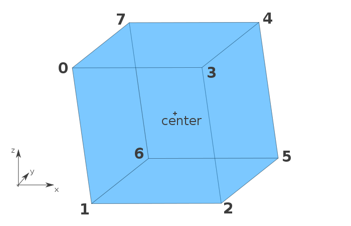

Based on code from https://www.sitepoint.com/building-3d-engine-javascript/

To be used to create animated CNN visualisations.

It has the following vertex schema in terms of vertex order. BUT, axes are
different. In my verion:

- X points right
- Y points up
- Z points to the front.

